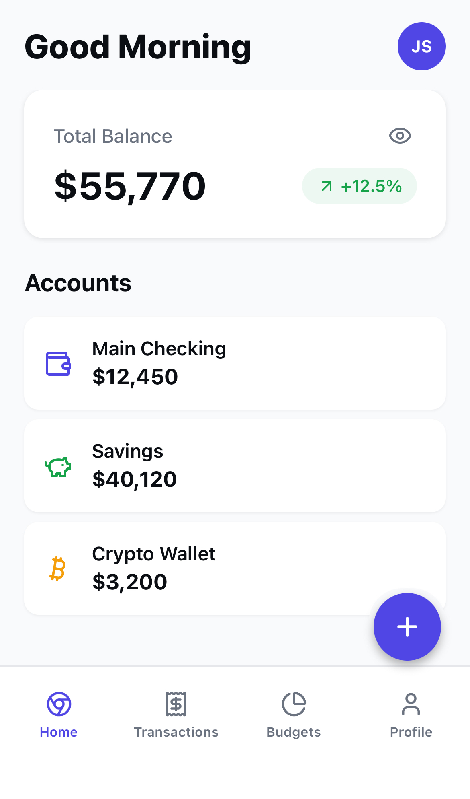
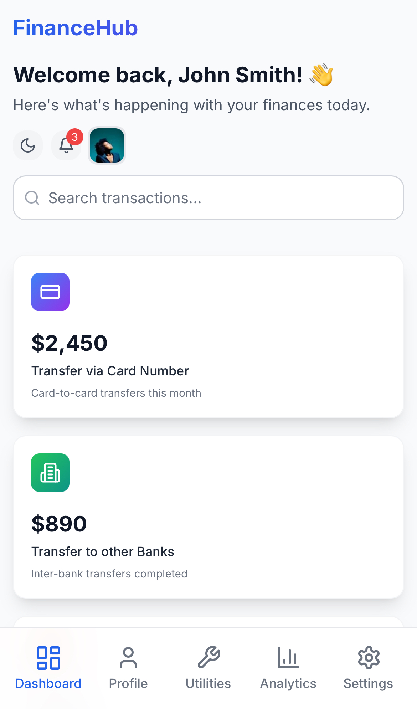
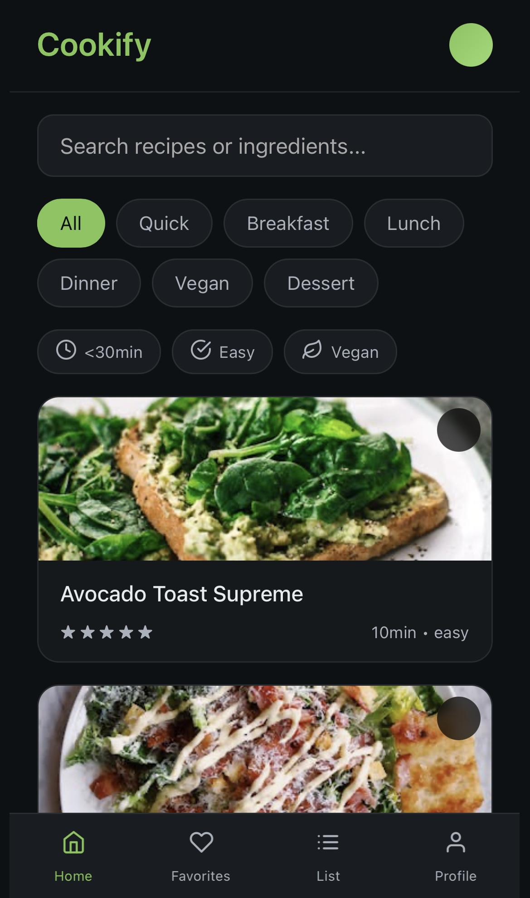
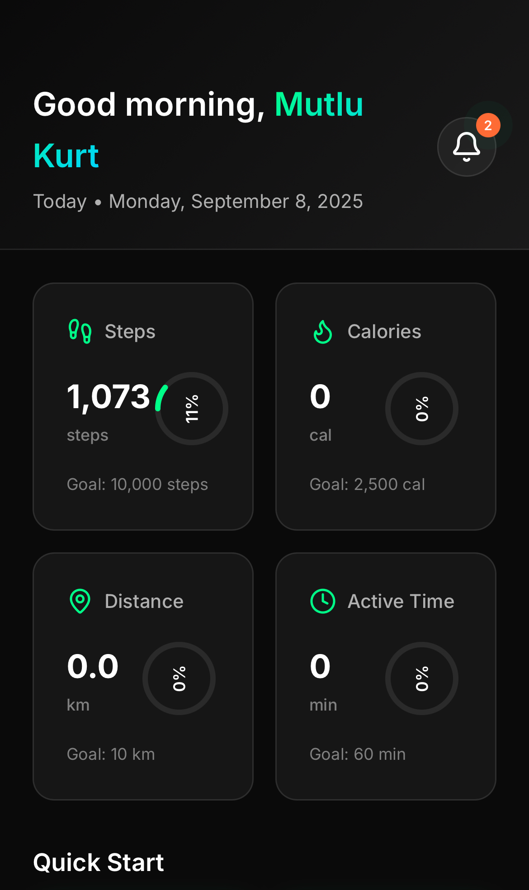

# Hi, I'm Mutlu Kurt 👋  

**AI-First Frontend Developer & Prompt Engineer**  
I build modern, responsive, production-ready interfaces for web and mobile. On the web I use **React / Next.js + Tailwind CSS + TypeScript**; on mobile I use **React Native + Expo**.  
Currently, I focus on **AI-Native workflows with Bolt.new & Spline.design**, combining speed, creativity, and automation to ship high-quality digital products.  

---

## 📂 Featured Projects  

<h4 style="margin: 0; color: #888; font-size: 14px; font-weight: normal;">Project 1</h4>

<h3 style="margin: 0; color: white; font-size: 18px; font-weight: bold;">Finora - Personal Finance Tracker</h3>

<a href="https://finora-personal-fina-hwth.bolt.host/" style="background: #4299e1; color: white; padding: 10px 20px; border-radius: 25px; text-decoration: none; font-weight: 500; font-size: 14px;">Live</a>
<a href="https://github.com/mutlukurt/finora-personal-finance-tracker-mobile-app" style="background: #2d3748; color: white; padding: 10px 20px; border-radius: 25px; text-decoration: none; font-weight: 500; font-size: 14px;">Repo</a>

<h4 style="margin: 0; color: #888; font-size: 14px; font-weight: normal;">Project 2</h4>

<h3 style="margin: 0; color: white; font-size: 18px; font-weight: bold;">FinanceHub - Modern Financial Dashboard</h3>

<a href="https://modern-financial-das-gd0a.bolt.host/" style="background: #4299e1; color: white; padding: 10px 20px; border-radius: 25px; text-decoration: none; font-weight: 500; font-size: 14px;">Live</a>
<a href="https://github.com/mutlukurt/financehub" style="background: #2d3748; color: white; padding: 10px 20px; border-radius: 25px; text-decoration: none; font-weight: 500; font-size: 14px;">Repo</a>

<h4 style="margin: 0; color: #888; font-size: 14px; font-weight: normal;">Project 3</h4>

<h3 style="margin: 0; color: white; font-size: 18px; font-weight: bold;">Cookify Recipe App</h3>

<a href="https://mutlukurt.github.io/cookify-recipe-app/" style="background: #4299e1; color: white; padding: 10px 20px; border-radius: 25px; text-decoration: none; font-weight: 500; font-size: 14px;">Live</a>
<a href="https://github.com/mutlukurt/cookify-recipe-app" style="background: #2d3748; color: white; padding: 10px 20px; border-radius: 25px; text-decoration: none; font-weight: 500; font-size: 14px;">Repo</a>

<h4 style="margin: 0; color: #888; font-size: 14px; font-weight: normal;">Project 4</h4>

<h3 style="margin: 0; color: white; font-size: 18px; font-weight: bold;">FitVibe - Modern Fitness Tracker</h3>

<a href="https://mutlukurt.github.io/FitVibe/" style="background: #4299e1; color: white; padding: 10px 20px; border-radius: 25px; text-decoration: none; font-weight: 500; font-size: 14px;">Live</a>
<a href="https://github.com/mutlukurt/FitVibe" style="background: #2d3748; color: white; padding: 10px 20px; border-radius: 25px; text-decoration: none; font-weight: 500; font-size: 14px;">Repo</a>

---

## 🌐 Connect  

- [LinkedIn](https://www.linkedin.com/in/mutlukurt)  
- [Twitter / X](https://twitter.com/mutlukurtio)  
- [GitHub](https://github.com/mutlukurt)  

---

✨ *Mission: push the boundaries of software development with **AI-Native** practices—shipping clean, efficient, future-proof products.*