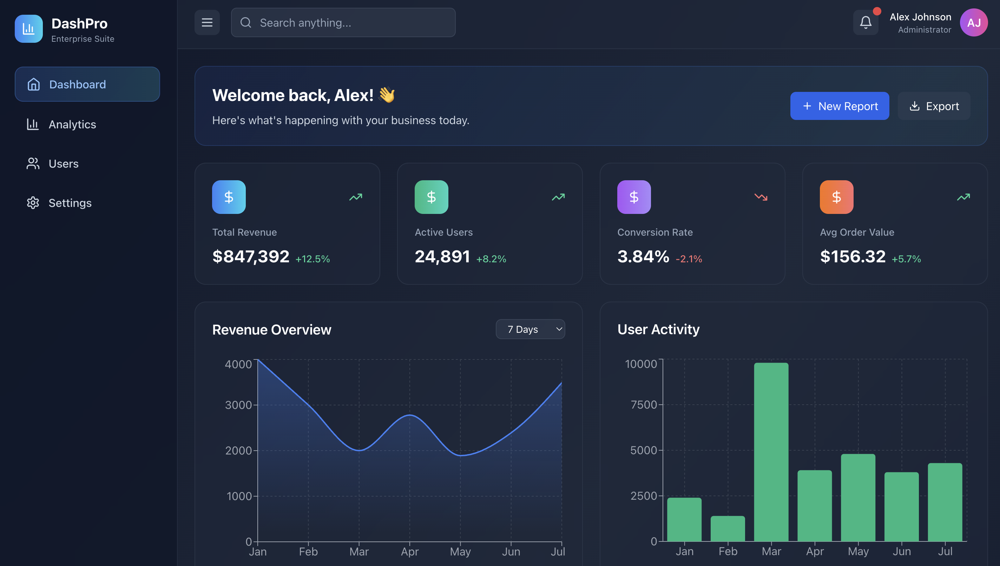
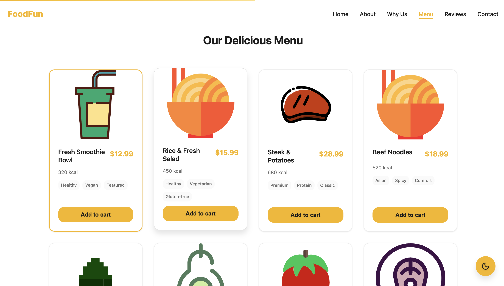
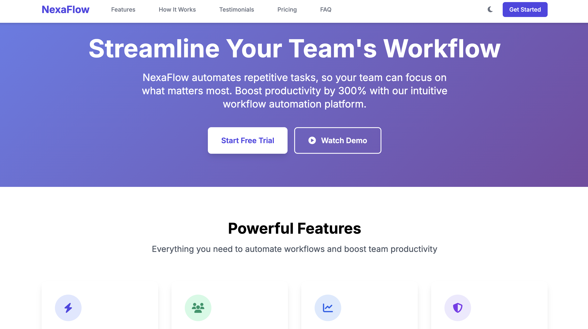
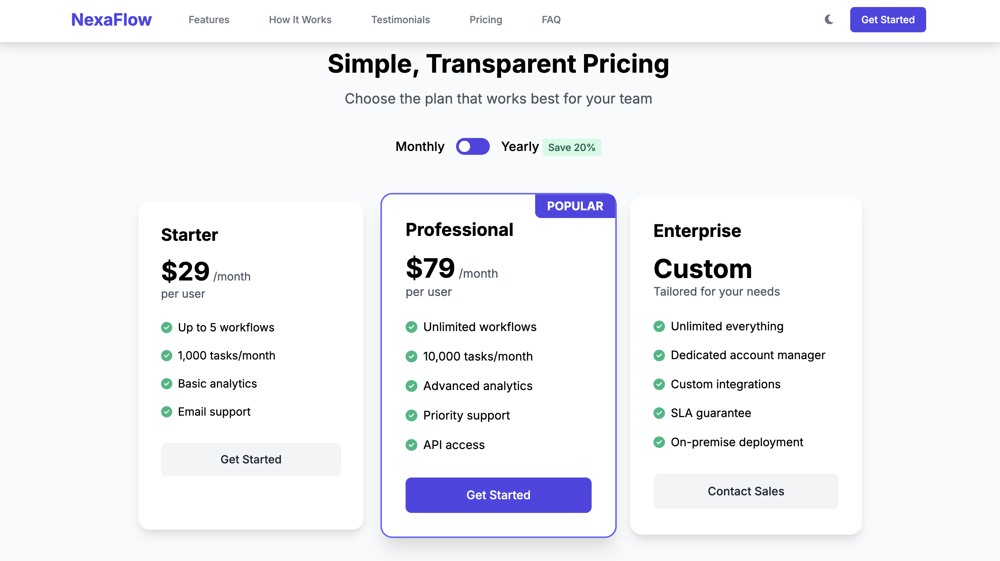

# Hi, I’m Mutlu Kurt  

I’m a **Modern Web & Frontend Developer** building fast, scalable, and user-focused digital products. My work combines traditional coding, AI-assisted workflows, and no-code/low-code platforms to deliver solutions that are both technically robust and visually engaging.  

---

<!-- GÖRSEL BANNER -->

  

---

## 🚀 What I Do
- **Web Development** → Responsive websites & apps (HTML, CSS, JavaScript, React)  
- **Frontend Engineering** → Clean, accessible, and performance-driven UIs  
- **UI/UX Design** → Prototyping and design with Figma & Framer  
- **Prompt Engineering** → Writing effective instructions for AI to generate code, content, and workflows  
- **No-Code/Low-Code Development** → Rapid prototyping & deployment with Cursor, Bolt, and Lovable  

---

<!-- TEKNOLOJİ GÖRSELİ -->

  

---

# Featured Projects

  
  

  
  

  

---

## 📊 Tools & Technologies  

  

---

<!-- DİNAMİK GÖRSEL: GITHUB İSTATİSTİKLERİ -->

  

<!-- TOP LANGUAGES -->

  

<!-- TROPHY -->

  

---

## 🌐 Connect With Me  

- [LinkedIn](https://www.linkedin.com/in/mutlukurt)  
- [Twitter / X](https://twitter.com/mutlukurtio)  
- [GitHub Projects](https://github.com/mutlukurt)  
