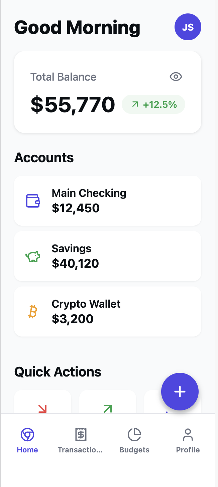
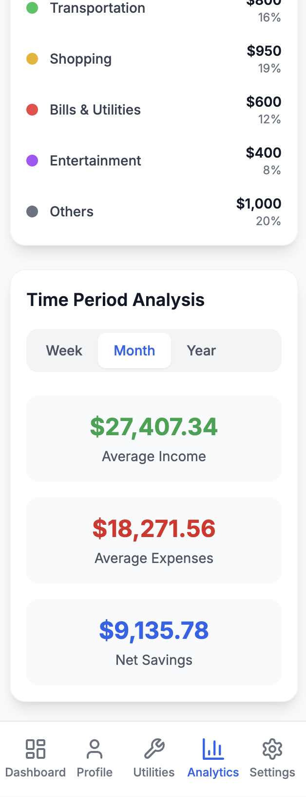
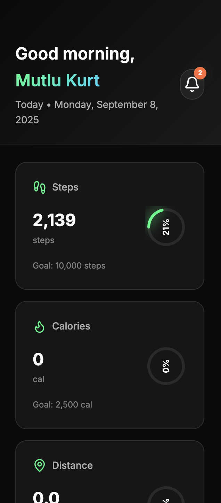
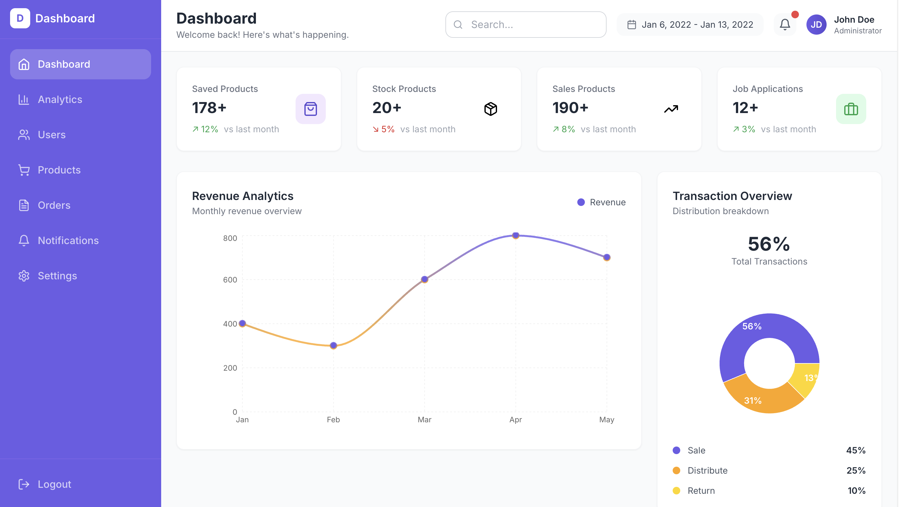
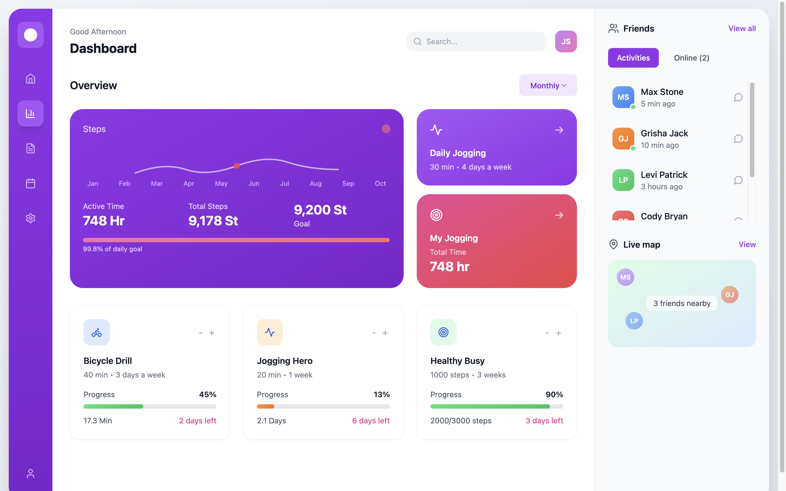

# Hi, I’m Mutlu Kurt 👋  

**AI-First Frontend Developer & Prompt Engineer**  
I build modern, responsive, production-ready interfaces for web and mobile. On the web I use **React / Next.js + Tailwind CSS + TypeScript**; on mobile I use **React Native + Expo**.  
Currently, I focus on **AI-Native workflows with Bolt.new & Spline.design**, combining speed, creativity, and automation to ship high-quality digital products.  

---

## 📂 Featured Projects  

### 📱 Mobile Apps

  <table>
    <tr>
      <td align="center" width="33%">
        
         <strong>Finora App</strong>
      </td>
      <td align="center" width="33%">
        
         <strong>FinanceHub</strong>
      </td>
      <td align="center" width="33%">
        
         <strong>FitVibe</strong>
      </td>
    </tr>
  </table>

### 🖥️ Desktop Projects

  <table>
    <tr>
      <td align="center" width="50%">
        
         <strong>Dashboard App</strong>
      </td>
      <td align="center" width="50%">
        
         <strong>Fitness Dashboard</strong>
      </td>
    </tr>
  </table>

---

## 🧰 Tools & Technologies  

  
  
  
  
  
  
  
  
  
  

---

<!-- VISUAL: Futuristic AI + Coding Intro -->

  

---

## 📈 GitHub Stats  

  

  

  

---

## 🌐 Connect  

- [LinkedIn](https://www.linkedin.com/in/mutlukurt)  
- [Twitter / X](https://twitter.com/mutlukurtio)  
- [GitHub](https://github.com/mutlukurt)  

---

✨ *Mission: push the boundaries of software development with **AI-Native** practices—shipping clean, efficient, future-proof products.*  
