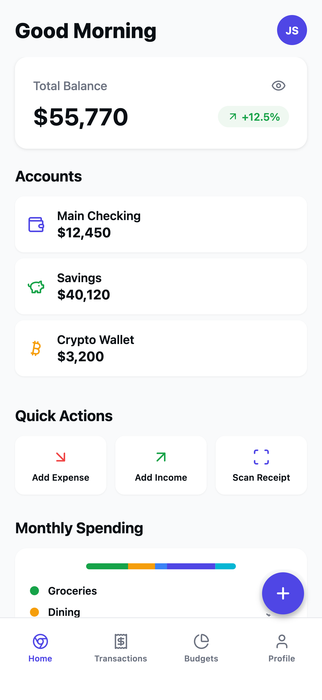
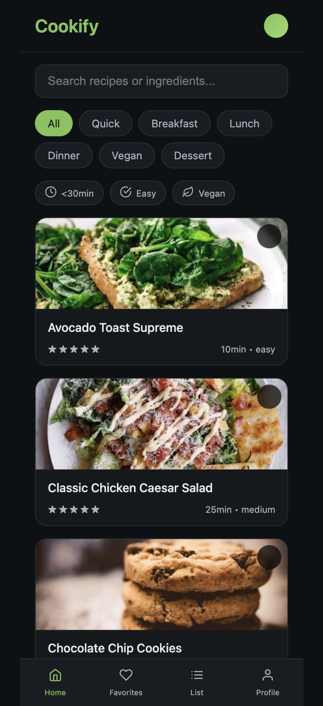
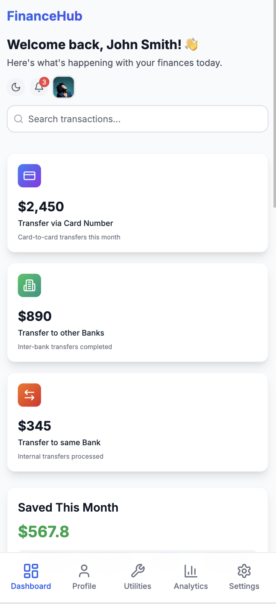
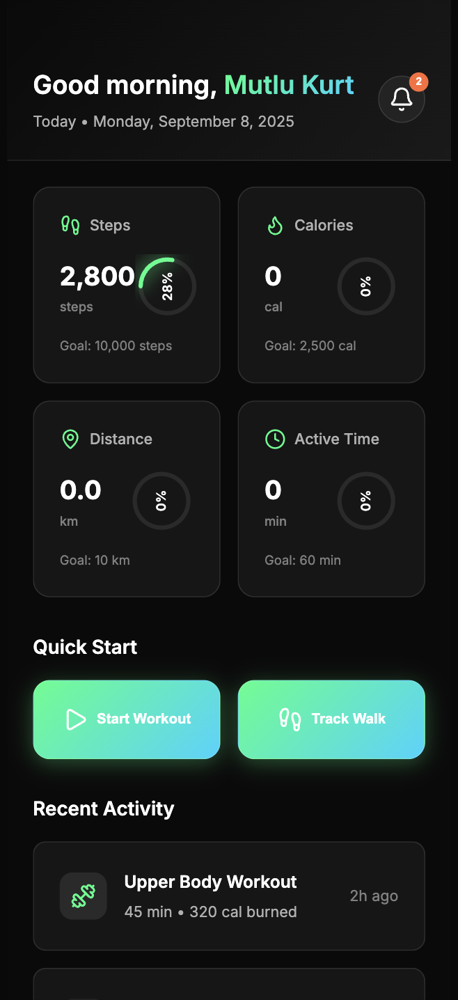

# Hi, I'm Mutlu Kurt 👋  

**AI-First Frontend Developer & Prompt Engineer**  
I build modern, responsive, production-ready interfaces for web and mobile. On the web I use **React / Next.js + Tailwind CSS + TypeScript**; on mobile I use **React Native + Expo**.  
Currently, I focus on **AI-Native workflows with Bolt.new & Spline.design**, combining speed, creativity, and automation to ship high-quality digital products.  

---
## ⭐ Featured Projects

| Finora | Cookify |
|:---:|:---:|
|  |  |
| Mobile-first finance tracker UI | Dark style recipe app |

| FinanceHub | FitVibe |
|:---:|:---:|
|  |  |
| Modern financial dashboard app | Dark theme fitness & activity tracker |

  

🌐 Connect  

- [LinkedIn](https://www.linkedin.com/in/mutlukurt)  
- [Twitter / X](https://twitter.com/mutlukurtio)  
- [GitHub](https://github.com/mutlukurt)  

---

✨ *Mission: push the boundaries of software development with **AI-Native** practices—shipping clean, efficient, future-proof products.*
 buradaki emoji olanları profesyonel svg iconlarla değiştir.
