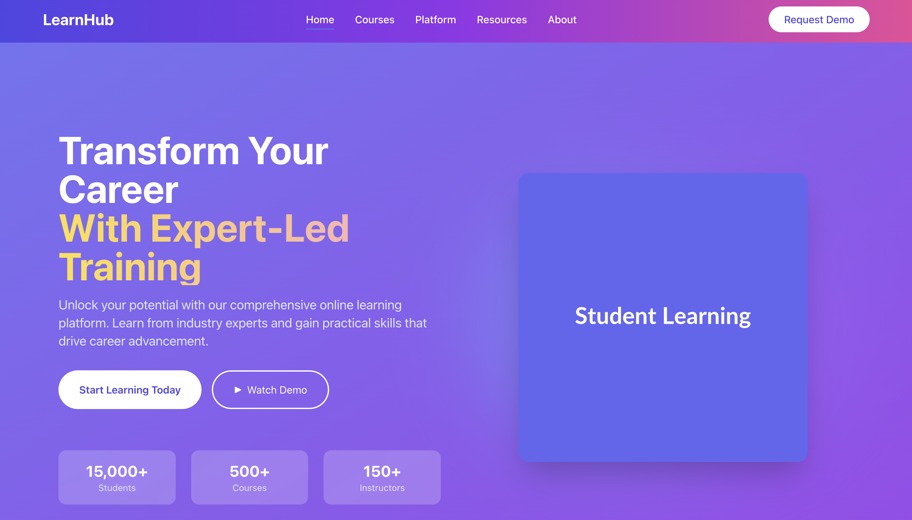

# Hi, I’m Mutlu Kurt 👋

**AI-First Frontend Developer & Prompt Engineer**  
I build modern, responsive, production-ready interfaces for web and mobile. On the web I use **React / Next.js + Tailwind CSS + TypeScript**; on mobile I use **React Native + Expo**.  
My edge is an **AI-Native engineering workflow**: I combine hands-on coding with **prompt engineering** and automation—powered primarily by **Claude Code CLI**—to ship faster, cleaner, and more maintainable products.

---

<!-- VISUAL: Futuristic AI + Coding Intro (GIF #1) -->

  

---

## 🔁 What “AI-First” and “AI-Native” Mean (in practice)

**AI-First** and **AI-Native** are not buzzwords; they’re operational rules that change *how* software is built.

### Principles
- **AI at day-zero:** AI participates from discovery and spec—**not** just during coding.
- **Prompts as code:** Prompts are versioned, reviewed, and tied to acceptance criteria.
- **Guardrails by default:** Accessibility, performance, and security constraints are embedded in prompts and CI.
- **Tight feedback loops:** Short, demoable vertical slices reduce risk and surface issues early.
- **Human-in-the-loop ownership:** AI accelerates; humans own architecture, taste, and trade-offs.

### Practices
- **Spec → Blueprint → Scaffold:** Convert user stories into a component map, routing plan, and typed contracts before UI work.
- **Prompted scaffolding:** Generate design tokens, utility layers, and test harnesses first to enforce consistency.
- **Critique prompts:** Ask AI to *self-review* for complexity, a11y, perf hotspots; only accept high-signal diffs.
- **Refactor cycles:** Iteratively restructure for readability and render performance, with smoke tests guarding regressions.
- **Documentation by design:** README, runbooks, and architecture notes are produced alongside features.

### Artifacts
- **Prompt templates** (system + task + constraints) checked into the repo.
- **Design tokens** and **atomic components** for consistent UI.
- **Typed interfaces** for stable collaboration surfaces.
- **Test suites** (unit, component, E2E smoke) wired to CI.
- **Decision records** (why we picked X over Y) to reduce institutional memory loss.

### Outcome Metrics
- **Lead time** to first demo and to production.
- **Defect rate** and **regression frequency** after refactors.
- **Lighthouse scores** (PWA/Perf/Best-Practices/SEO) and a11y audits.
- **Change failure rate** (how often a deploy causes issues).
- **Onboarding speed** (new dev time-to-first-PR).

---

## 🧠 Why Claude Code (CLI) for Production Work

I’ve evaluated Cursor, Bolt, Lovable, Emergent, and Rork. They each shine in certain scenarios (rapid UI spikes, ideation, visual exploration), and I do use them tactically.  
For **production-grade delivery**, I lead with **Claude Code CLI** because it is:

### 1) Lightweight & Focused
- **Zero UI noise:** CLI ergonomics keep attention on problem-solving.
- **Composable by nature:** Easily scripted with npm/Yarn; prompts become reproducible steps in your build.

### 2) High-quality Structured Output
- **Cleaner boundaries:** Tends to respect component seams and typed contracts.
- **Refactor-friendly:** Strong at generating diffable changes without stylistic churn.
- **Specification adherence:** When fed a strict prompt template, it aligns tightly with constraints.

### 3) Iterative Speed with Discipline
- **Prompt → Diff → Test → Repeat:** Short cycles produce demoable slices fast.
- **Guardrails baked in:** ESLint/Prettier, type checks, and tests run on every iteration.
- **Deterministic prompts:** Versioned prompt files reduce variability between runs.

### 4) CI/CD & Team Fit
- **Scriptable prompts:** Run the same prompts in CI to regenerate artifacts (docs, types, test stubs).
- **Traceability:** PRs include the prompt context for auditability and knowledge transfer.
- **Scalable governance:** Teams can codify do/don’t lists and non-functional requirements in the prompt layer.

**Bottom line:** Claude Code CLI keeps velocity high **without** sacrificing readability, reliability, or team governance.

---

## 🧩 My Prompt Engineering System

**Goal:** correctness, clarity, consistency, and speed—*with* maintainability.

1. **Prompt templates (system + task + constraints)**  
   - Coding standards (TS strictness, lint rules)  
   - UI contract (atomic components, a11y expectations, Tailwind tokens)  
   - Non-functionals (Lighthouse targets, bundle budgets)  
   - Security (validation patterns, output sanitization, auth flows)

2. **Spec-to-Code scaffolding**  
   - Map stories → file tree & component graph  
   - Generate design tokens, shared utils, typed APIs  
   - Establish “walking skeleton” with routing, layout, and state

3. **Critique & self-review**  
   - Ask for complexity scoring, a11y checks, perf hotspots  
   - Prefer **diffs only** to control change scope

4. **Test generation & growth**  
   - Unit tests (Vitest/Jest) for logic  
   - Component tests (React Testing Library) for UI contracts  
   - E2E smoke (Playwright/Cypress) for main journeys

5. **Refactor & hardening loops**  
   - Eliminate prop drilling; memoize costly renders  
   - Code-split by route; lazy-load noncritical features  
   - Verify with E2E smoke + perf snapshot

6. **Docs & DX**  
   - Autogenerate README sections, scripts, envs, and ADRs  
   - JSDoc on exported APIs; optional Storybook for shared components

7. **Localization & content** (when needed)  
   - i18n scaffolding; copy generation aligned to a project glossary

---

<!-- VISUAL: Prompt/Build Energy (REPLACED middle GIF with your link) -->

  

---

## 🧭 End-to-End Delivery Workflow (Claude CLI Loop)

1. **Discovery & goals** → clarify business outcomes, KPIs, risky assumptions.  
2. **Spec & blueprint** → user stories, acceptance criteria, data contracts, component map.  
3. **Scaffold** → repo, CI, lint/test hooks, base routes, tokens, error boundaries, logging.  
4. **Thin vertical slices** → each slice ships a coherent user outcome: prompt → code → diff → test → demo.  
5. **QA & hardening** → budgeted perf, a11y checks, security validations, offline and error-state UX.  
6. **Deployment** → Vercel (web), Expo EAS/OTA (mobile); feature flags for safe rollout.  
7. **Handover** → docs, scripts, ADRs, governance notes, and a maintainer’s quickstart.

**Net effect:** measurable velocity, transparent checkpoints, and a codebase your team can confidently own.

---

## 🧮 How Clients Benefit (Concrete Value)

- **Time-to-first-value:** hours/days, not weeks.  
- **Quality:** repeatable AI reviews + human architecture decisions.  
- **Lower maintenance:** typed code, tests, ADRs, and docs reduce future friction.  
- **Scale from day 1:** smart routing, state strategy, caching, and error handling.  
- **Clarity & control:** demoable slices, short feedback loops, prompt history in PRs.  
- **Risk reduction:** security/a11y/perf guardrails and feature-flagged rollouts.

---

## 🧱 Tech & Architecture Choices

- **Web:** React, Next.js (App Router), Tailwind CSS, TypeScript  
- **Mobile:** React Native + Expo (OTA updates, Expo Go for quick QA)  
- **State & Data:** Zustand/Redux/Context; SWR/React Query  
- **APIs & Backends:** REST/GraphQL; integrates with Supabase/Firebase/Hasura or your stack  
- **Testing:** Vitest/Jest, React Testing Library, Playwright/Cypress  
- **CI/CD:** GitHub Actions; Vercel (web); EAS or Fastlane (mobile)  
- **Monitoring:** Sentry/LogRocket, basic observability hooks

---

## 🧪 Quality, Performance, Security

- **Performance budgets:** target Lighthouse ≥ 90 where feasible; route-level code split; prefetch strategy.  
- **Accessibility:** semantic HTML, ARIA roles, focus trapping, keyboard nav; audited via CI.  
- **Security:** input validation, sanitized rendering, secret hygiene, auth flows with proper error states.  
- **Reliability:** unit + E2E smoke; PR checks block merges on regressions.

---

## 📦 Deliverables You Receive

- Clean, typed, production-ready code (web and/or mobile)  
- A maintained **README** with setup/run/test/deploy instructions  
- Preconfigured **CI** and baseline tests  
- Component library and design tokens for consistent UI  
- Optional Storybook and architecture decision records (ADRs)  
- A clear **handover checklist** for fast team onboarding

---

## 🤝 Engagement Models

- **Prototype Sprint (2–5 days):** validate an idea with a working vertical slice  
- **MVP (1–3 weeks):** core product, tests, CI, deploy  
- **Scale & polish (ongoing):** performance, a11y, analytics, features, QA

---

## 📂 Featured Projects (selected)

  
  

  
  

  

---

## 🧰 Tools & Technologies

---

<!-- VISUAL: Build/Deploy Energy (GIF #3) -->

  

---

## 📈 GitHub Stats

  

  

  

---

## 🌐 Connect

- [LinkedIn](https://www.linkedin.com/in/mutlukurt)
- [Twitter / X](https://twitter.com/mutlukurtio)
- [GitHub](https://github.com/mutlukurt)

---

✨ *Mission: push the boundaries of software development with **AI-Native** practices—shipping clean, efficient, future-proof products.*
